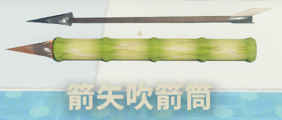

# ArrowBlowgun

ArrowBlowgun adds a networked blowgun variant that applies PEAK's arrow injury instead of the vanilla dart afflictions.

The item is cloned from the current vanilla blowgun at runtime, so it keeps the original model, icon, hold pose, use timing, and loot configuration. It has three uses by default, and its shot feedback matches the arrow trap.



## Requirements

- BepInExPack for PEAK

All players in a multiplayer lobby must have the mod installed.

## Behavior

- Registers a separate `Arrow Blowgun` item without changing the vanilla blowgun.
- Registers directly with PEAK's item database and current Photon prefab pool without third-party libraries.
- Uses the arrow trap's 80-meter raycast range, four-layer shot sound, muzzle puff, and smoke trail.
- Displays a loaded vanilla arrow at the blowgun muzzle to distinguish it from the dart variant.
- Embeds arrows in terrain until the current scene is unloaded, matching the vanilla trap behavior.
- Applies the built-in arrow injury and a small knockback when a character is hit.
- Synchronizes shot feedback, wall arrows, arrow injury, knockback, and item uses through Photon.
- Uses three shots by default instead of the vanilla blowgun's single shot.
- Displays the remaining uses in the inventory durability bar when configured above one use.
- Inherits the vanilla blowgun's loot pools and rarity.

## Configuration

BepInEx creates `BepInEx/config/com.github.jie65535.ArrowBlowgun.cfg` after the mod is loaded once.

- `[Balance] Uses`: shots before the Arrow Blowgun is consumed. Default: `3`. Minimum: `1`.

Restart the game after changing the value. In multiplayer, the room creator's value is synchronized to every player and becomes the room rule; guests' local values are ignored until they leave the room.

## Development

Build from the repository root:

```powershell
dotnet build .\ArrowBlowgun.slnx -c Debug
dotnet build .\ArrowBlowgun.slnx -c Release
```

The project targets PEAK `2.1.a` build `0657e527f`.

The MIT license applies to the source code. Embedded PEAK audio remains the property of its respective owners.
